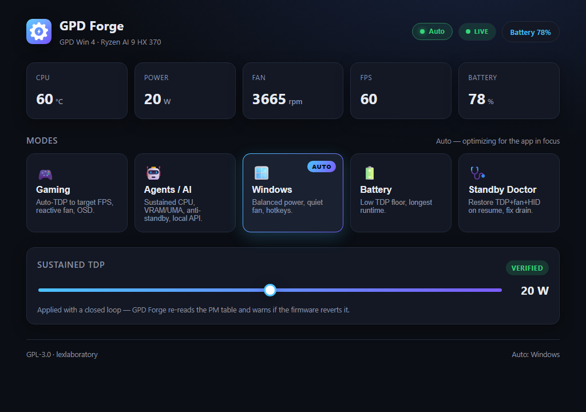

<div align="center">

# ⚙️ GPD Forge

**The definitive open-source tuning tool for GPD handhelds.**
A modern, gamepad-native replacement for MotionAssistant and GPD Tool — built to fix what they get wrong.

[](LICENSE)




</div>

---

## Why this exists

GPD's own `MotionAssistant` and `GPD Tool` are closed-source binaries that ship real, reproducible
problems: TDP that silently reverts (the app re-applies it every 30s as a band-aid), a fan controller
whose EC is left uninitialized on boot, background services that keep acting after the UI closes, a
`WinRing0` driver that Defender flags as a vulnerable driver, and a heavy UI that isn't gamepad-navigable.
GPD Forge is a clean-room, community-first tool that treats those as the core requirements — not
afterthoughts — and adds the one thing nobody ships: a **local-AI / agents mode** and a **local API**
so your own automation can drive the device.

> **Goal:** reach parity with MotionAssistant + GPD Tool, then *replace* them.

## Design principles

- **Daemon-first.** All hardware work lives in a background Windows Service exposing a **local API**
  (HTTP + WebSocket / named pipe). The GUI, the overlay, and any external agent are all just clients.
- **Closed-loop, never fire-and-forget.** Every TDP/fan write is verified by reading hardware back and
  retried with backoff — and surfaced to the user when the firmware fights us.
- **Least privilege at the metal.** The default telemetry path is **driverless (WMI)**. Anything that
  needs a kernel driver (package watts, temps, TDP, EC fan) is **opt-in behind `GPDFORGE_ENABLE_HARDWARE`
  + elevation**. Target for that path is **PawnIO** (signed modules in a restricted VM), not `WinRing0`.
  *Current status:* **EC access already runs on PawnIO** (`core/Fan/PawnIoEcPort.cs`, using the module
  embedded in LibreHardwareMonitorLib — no separate install). The optional richer **sensors** still ride
  on LibreHardwareMonitor's Ring0-family driver; migrating that half too is the remaining target. The
  decision and its consequences: [`docs/adr/0001`](docs/adr/0001-pawnio-over-winring0-for-ec-access.md).
- **Zero visual & functional defects.** Every change passes a verification gate: build → types → lint →
  tests (≥80%) → security, plus **Playwright** E2E against the web UI (or computer-use on the real GPD).

## Usage modes

| Mode | What it does |
|---|---|
| 🎮 **Gaming** | Per-game auto-TDP to a target FPS (PresentMon/ETW + PID control), reactive fan curve, RTSS OSD, quick-menu overlay. |
| 🤖 **Agents / AI (local)** | Reassigns VRAM/UMA for local models, favors sustained CPU over GPU boost, "sustained" fan curve, blocks Modern Standby during inference, exposes a job queue via the local API. *The differentiator no other tool ships.* |
| 🪟 **Windows / Productivity** | Balanced power, quiet fan, hotkeys, tablet-mode fixes. |
| 🔋 **Battery** | Aggressive undervolt-safe TDP floor, battery-budget estimate ("47 min left at this TDP"). |
| 🩺 **Standby Doctor** | Restores TDP + fan + HID state on resume, toggles fingerprint/S0↔S3, wraps `powercfg sleepstudy`. |

## Architecture

```
gpd-forge/
├── core/       # C#/.NET 9 Windows Service (SYSTEM). All hardware lives here.
│   ├── Tdp/        # ryzenadj wrapper + closed loop (apply → re-read PM table → retry w/ backoff)
│   ├── Fan/        # direct EC access (per-model gpd-fan registers) + boot/resume re-init + hysteresis curves
│   ├── Telemetry/  # LibreHardwareMonitor (temps/watts) + PresentMon (FPS) + WMI
│   ├── Hid/        # ViGEmBus + HidHide (virtual pad, device hiding) + L4/R4 remap (SET_REPORT, 1024B backup)
│   ├── Rtss/       # RTSS "single owner" (detect HC/MA/GPDT, back up config, cede/reclaim)
│   ├── Broker/     # PawnIO, least privilege, audit log of every MSR/EC write
│   ├── Profiles/   # focus-process profiles (gaming/AI/windows/battery) with anti-flapping hysteresis
│   ├── Modes/      # AiWorkload, Standby Doctor, Firmware assist
│   └── Api/        # HTTP + WebSocket / named pipe — agents change profiles here
├── ui/         # Tauri 2 + React/Vite. Pure client of core/Api. Gamepad-navigable. Quick-menu overlay.
├── tests/e2e/  # Playwright (Page Object Model, screenshot-on-failure, quarantine) — the zero-defect gate
├── tools/      # dev tooling — mock daemon (docs/api.md) + UI snapshot helper
└── docs/       # architecture, runbooks (EC recovery), CONTRIBUTING
```

## Hardware support

Primary target: **GPD Win 4 (2025), Ryzen AI 9 HX 370 / Radeon 890M**. The `Fan/` layer is designed
around the per-model EC register map published by the [`gpd-fan`](https://github.com/Cryolitia/gpd-fan-driver)
Linux driver, so support extends to Win 4 6800U/7840U/8840U, Win Mini, Win Max 2, and Pocket 4.

## Credits & upstream (GPL-3 ecosystem)

Built on the shoulders of the community. GPD Forge is GPL-3 so it can honor and reuse this work:

- [HandheldCompanion](https://github.com/Valkirie/HandheldCompanion) (GPL-3) — QuickTools, Auto-TDP, virtual controller.
- [Universal x86 Tuning Utility](https://github.com/JamesCJ60/Universal-x86-Tuning-Utility) (GPL-3) — presets, PawnIO backend.
- [RyzenAdj](https://github.com/FlyGoat/RyzenAdj) (LGPL) — the SMU/TDP engine.
- [gpd-fan-driver](https://github.com/Cryolitia/gpd-fan-driver) (GPL-2) — the EC register map.
- [PawnIO](https://pawnio.eu/) — the modern, safe WinRing0 replacement.

See [`docs/CREDITS.md`](docs/CREDITS.md) and [`NOTICE`](NOTICE) for the full attribution and license inventory.

## Status

**v0.2.0 — released 2026-08-30.** Running on real hardware: verified closed-loop TDP (confirmed on a
Ryzen AI 9 HX 370), EC fan read and control through PawnIO with hysteresis curves, AMD Radeon profiles
and a real frame cap (FRTC) applied per app, standby measurement and hibernate policy, focus-process
auto-profiles, an audit log of every hardware write, a local API, an MCP server, and a gamepad-native
desktop app and overlay.

Hardware writes stay **opt-in behind gates** (`GPDFORGE_ENABLE_HARDWARE`, and fan control behind a
second one). Controller remapping is **blocked on a measured fact** — the pad exposes no HID feature
reports on this device — and firmware flashing is **refused by design**.

What is open, blocked, dropped, or awaiting triage is tracked in one place:
[`docs/ROADMAP.md` § *Open, blocked, and dropped*](docs/ROADMAP.md#open-blocked-and-dropped).
Decisions that constrain future work: [`docs/adr/`](docs/adr/README.md).

## License

[GPL-3.0-or-later](LICENSE). © 2026 lexlaboratory.
